# MultiVoucher-Audit

更新时间：2026-08-13

MultiVoucher-Audit 是一个面向企业费用报销一致性审计的 VLM 后训练项目。它用合成但可控的多凭证报销数据训练和评测 `Qwen3-VL-8B-Instruct`，要求模型同时读取发票、支付截图、报销申请单和订单截图，输出可程序评测的 Evidence-Grounded JSON。

代码逐文件说明见 [docs/code_inventory.md](docs/code_inventory.md)。本文是论文式工程报告，重点说明任务、数据集、模型方法、损失函数、训练设置、benchmark、SFT/DPO 实验结果和失败原因。

## 摘要与核心结论

本项目研究的问题不是普通 OCR，也不是单图 VQA，而是多张报销凭证之间的结构化一致性审计。模型输入是一个 case 下的 2 到 4 张凭证图片，输出必须是固定 schema 的 JSON，包含字段抽取、跨图一致性判断、风险等级、审核建议、原因、证据、bbox 和不确定性。

当前最重要结论：

| 结论 | 证据 | 判断 |
| --- | --- | --- |
| LoRA-SFT 有效 | M2 在 sample500 平均 `Audit Accuracy=0.7735`、`Evidence Support Rate=0.8035`、`JSON Validity=1.000` | SFT 成功建立结构化输出、字段抽取、证据引用和基础审计能力 |
| 原生模型不足 | M0 zero-shot 平均 `Audit Accuracy=0.000`，M1 few-shot 平均 `0.0785` | 仅靠 prompt/few-shot 不能完成该任务 |
| DPO v1 是负结果 | M3 的 DPO loss 降到 `0.000568`、preference margin 到 `74.731`，但 `Audit Accuracy` 从 M2 `0.7735` 降到 `0.6685` | pair 训练成功不等于业务成功 |
| DPO v2 部分修复 | M3v2 `Audit Accuracy=0.7645`，接近 M2；但 `High-risk Miss Rate=0.2546`，差于 M2 `0.2427` | 修复了 accuracy 崩塌，但没有解决高风险漏检 |
| two-candidate ablation 不值得扩大 | `dpo_v2_baseline` 与 `auxdpo_v2_strong` 在 Train decode dev 核心指标相同，High-risk Miss 都是 `0.2299` | 继续烧完整 DPO/IPO ablation 不划算 |
| 下一步应做 High-risk Repair | 已准备 120 条 Train-only high-risk non-pass repair cases 和 120 条 calibration mix | 小规模 SFT/规则约束闭环优先于继续 DPO/GRPO |

一句话总结：M2 SFT 是目前业务基线；DPO loss/margin 的优化没有可靠转化为高风险漏检改善，因此 Phase08 应被写成 DPO negative result，并转向 High-risk Miss 的数据与输出契约修复。

## 1. 任务定义与 Benchmark

### 1.1 业务任务

企业费用报销审核通常需要同时检查多份材料：

- 发票：金额、税额、销售方、发票号、日期。
- 支付截图：支付金额、收款方、支付人、支付流水号、支付日期。
- 报销申请单：申请人、报销金额、申请日期、费用类型。
- 订单截图：订单金额、商户、订单用户、订单号、订单日期。

模型需要判断：

- 金额是否一致，例如发票金额、支付金额、订单金额和报销金额是否矛盾。
- 商户是否一致，例如发票销售方和支付收款方是否明显不同。
- 人员是否一致，例如申请人、付款人和订单用户是否一致。
- 日期是否合理，例如支付日期、订单日期、发票日期和申请日期顺序是否异常。
- 订单号和支付流水是否存在或一致。
- 材料是否缺失、图片是否不可读、是否存在重复凭证。

### 1.2 输入与输出

输入是一个 case 的多图集合：

```text
case_id
+ invoice image
+ payment image
+ reimbursement_form image
+ optional order image
```

输出必须是 Evidence-Grounded JSON，核心字段包括：

| 字段 | 含义 |
| --- | --- |
| `case_id` | 当前报销 case 的唯一 ID |
| `field_extraction` | 抽取金额、商户、人员、日期、订单号等字段 |
| `consistency_check` | 跨图一致性布尔判断 |
| `anomaly_types` | 异常类型列表 |
| `risk_level` | `low`、`medium`、`high` |
| `audit_result` | `pass`、`manual_review`、`reject_recommendation`、`missing_info` |
| `reason` | 审核结论的自然语言理由 |
| `evidence` | 支持结论的来源图片、字段、值、bbox、证据文本 |
| `uncertainty` | 不确定字段和是否需要人工复核 |

### 1.3 Benchmark 与模型编号

项目内部 benchmark 不是通用 VLM 榜单，而是 `sample500` 业务评测：四个 split，每个 split 500 条，共 2000 条测试样本。评测产物归档在 `docs/experiments/`。

| 编号 | 模型形态 | 评测状态 |
| --- | --- | --- |
| M0 | `Qwen3-VL-8B-Instruct` zero-shot | 已完成 Phase07 sample500 |
| M1 | `Qwen3-VL-8B-Instruct` few-shot | 已完成 Phase07 sample500 |
| M2 | `Qwen3-VL-8B-Instruct + LoRA-SFT` | 已完成训练、val loss、sample500，当前业务基线 |
| M3 | `M2 + DPO v1 adapter` | 已完成 DPO sample1000 和 sample500，业务失败 |
| M3v2 | `M2 + conservative DPO v2 adapter` | 已完成 DPO v2 和 sample500，部分修复但未达目标 |
| M4 | `M2/M3 + GRPO` | 未正式完成，仅有 smoke 级别代码与验证 |
| repair_sft_r1 | `M2 + High-risk Repair SFT` | 已准备配置和数据包，服务器训练未完成 |

## 2. 合成数据集 MultiVoucher-Audit

### 2.1 为什么使用合成数据

真实企业报销数据包含个人姓名、商户、订单、支付流水和财务信息，直接用于实验存在隐私和合规问题。本项目采用可控合成数据，以便同时获得：

- 字段真值：每个金额、商户、人员、日期都有标准答案。
- 异常真值：每个 case 的异常类型、风险等级、审核建议可程序生成。
- 证据真值：每个字段在图片上的 bbox 和证据文本可追踪。
- 切分控制：Train/Val/Test 按 case 级别切分，避免同一 case 泄漏。

### 2.2 数据生成链路

```text
词典与 schema
-> 生成正常报销 case
-> 注入业务异常
-> 风险规则打标
-> case-level split
-> 渲染四类凭证图片
-> 记录字段 bbox
-> 构造 SFT / DPO / GRPO / eval sets
```

核心代码入口：

| 阶段 | 代码/脚本 |
| --- | --- |
| case 生成 | `src/mv_audit/data_gen/generate_base_cases.py` |
| 异常注入 | `src/mv_audit/data_gen/anomaly_injector.py` |
| 风险规则 | `src/mv_audit/data_gen/risk_rule_engine.py` |
| case 切分 | `src/mv_audit/data_gen/split_builder.py` |
| 图片渲染 | `src/mv_audit/rendering/render_all.py` |
| bbox 记录 | `src/mv_audit/rendering/bbox_recorder.py` |
| SFT/DPO/GRPO 构造 | `src/mv_audit/converters/` |

### 2.3 数据规模

主实验数据规划为 41,000 个 case：

| split | cases | 用途 |
| --- | ---: | --- |
| train | 30,000 | SFT、DPO、GRPO、High-risk Repair 候选来源 |
| val_in_template | 2,000 | SFT validation 和模板内验证 |
| val_unseen_template | 1,000 | 未见模板验证 |
| test_clean | 2,000 | 标准测试 |
| test_robust | 2,000 | 图像扰动测试 |
| test_unseen_template | 2,000 | 未见模板测试 |
| test_hard_negative | 2,000 | 高风险/困难负例测试 |

一个 case 最多包含 4 张图片，因此完整 main 数据约为 16 万级图片。历史核查记录显示 `images_main` 约 162,770 张图片。

本次真实 SFT 训练使用的是服务器 existing-images 子集：

| 数据 | 路径 | 样本数 | 用途 |
| --- | --- | ---: | --- |
| SFT train | `data/mv_audit/sft_main/train_existing_images.jsonl` | 21,682 | LoRA-SFT |
| SFT val | `data/mv_audit/sft_main/val_existing_images.jsonl` | 1,138 | validation loss |
| DPO v1 pairs | `data/mv_audit/dpo_main/pairs_train.jsonl` | sample1000 使用 1000 pairs | M3 DPO |
| DPO v2 train pairs | `data/mv_audit/dpo_v2/pairs_train.jsonl` | 3,000 | M3v2 DPO |
| DPO v2 holdout pairs | `data/mv_audit/dpo_v2/pairs_holdout.jsonl` | 300 | pair holdout 监控 |
| Train decode dev | `data/mv_audit/dpo_v2/train_decode_dev.jsonl` | 152 实际可解码行 | 训练域小评测 |
| High-risk Repair Pack | `docs/experiments/phase08_high_risk_repair_pack_20260813/repair_pack_sft.jsonl` | 120 | repair_sft_r1 修复样本 |
| repair SFT mix | `docs/experiments/phase08_high_risk_repair_pack_20260813/repair_sft_train_mix.jsonl` | 240 | 120 repair + 120 calibration |

### 2.4 异常类型

主要异常族：

| 异常 | 含义 | 常见风险 |
| --- | --- | --- |
| `amount_mismatch` | 发票、支付、订单、报销金额不一致 | medium/high |
| `over_reimbursement` | 报销金额高于真实支付或发票金额 | high |
| `merchant_mismatch` | 商户或收款方不一致 | high |
| `applicant_mismatch` | 申请人、付款人、订单用户不一致 | high |
| `date_mismatch` | 订单、支付、发票、申请日期顺序异常 | medium/high |
| `order_id_mismatch` | 订单号不一致或无法对应 | high |
| `missing_document` | 缺少关键凭证 | high，但常输出 `missing_info` |
| `unreadable_image` | 关键字段不可读 | high/manual review |
| `duplicate_in_batch` | 批内重复凭证 | high |
| `none` | 无异常 | low/pass |

### 2.5 数据边界

本项目特别强调防止评测泄漏：

- DPO/GRPO/High-risk Repair 候选只来自 MV-Train。
- sample500/test 只用于冻结后的业务评测和报告，不进入训练、调参或候选选择。
- DPO v2 使用 case-level train/holdout/decode-dev 切分，overlap 均为 0。
- High-risk Repair Pack 与 DPO holdout、train_decode_dev、sample500 overlap 均为 0。

## 3. 模型架构与工程链路

### 3.1 基座模型

基座模型为 `Qwen3-VL-8B-Instruct`。本地模型资产位于：

```text
models/Qwen3-VL-8B-Instruct/
```

重要模型元数据：

| 文件 | 作用 |
| --- | --- |
| `config.json` | 模型结构配置 |
| `tokenizer.json`、`vocab.json`、`merges.txt` | 文本分词 |
| `chat_template.json` | 多轮对话模板 |
| `preprocessor_config.json` | 图片预处理 |
| `generation_config.json` | 默认生成参数 |
| `model.safetensors.index.json` | 权重 shard 索引 |
| `*.safetensors` | 大模型权重，不进 Git |

### 3.2 Adapter 结构

本项目不全量微调 8B 基座模型，而是训练 adapter：

```text
Qwen3-VL-8B-Instruct
    |
    +-- LoRA-SFT adapter -> M2
             |
             +-- DPO adapter -> M3 / M3v2 / ablation variants
             |
             +-- High-risk Repair SFT adapter -> repair_sft_r1
```

LoRA 目标模块：

```text
q_proj, k_proj, v_proj, o_proj, gate_proj, up_proj, down_proj
```

### 3.3 端到端工程链路

```text
case schema + dictionaries
-> raw cases
-> anomaly injection + risk rules
-> voucher rendering + bbox recording
-> SFT/DPO/GRPO data
-> LoRA-SFT / DPO / GRPO training
-> batch inference
-> evaluate_all metrics
-> error migration / archive / repair pack
```

推理统一入口是 `src/mv_audit/inference/batch_inference.py`，评测统一入口是 `src/mv_audit/evaluation/evaluate_all.py`。

## 4. 训练目标、损失函数与优化器

### 4.1 SFT 目标

SFT 训练目标是让模型在给定多图输入 `x` 后生成标准答案 `Y = {y_1, ..., y_T}`。训练时只对 assistant answer token 计算 loss，用户 prompt 和图片占位不计入监督损失。

公式：

```text
L_SFT = - (1 / |Y|) * sum_t log p_theta(y_t | x, y_<t)
```

实现位置：

- `src/mv_audit/training/train_sft.py`
- `DataCollatorForQwenVLSFT`
- Hugging Face `Trainer`

SFT 优化器由 `Trainer` 根据 `TrainingArguments` 使用 AdamW 类优化器；训练配置里显式设置 learning rate、batch、gradient accumulation、bf16、eval/save steps。

### 4.2 DPO 目标

DPO 使用同一个 prompt 下的 chosen answer 和 rejected answer。令：

```text
logit = [log pi_theta(y_c|x) - log pi_theta(y_r|x)]
        - [log pi_ref(y_c|x) - log pi_ref(y_r|x)]
```

DPO loss：

```text
L_DPO = - log sigmoid(beta * logit)
```

其中：

- `pi_theta` 是当前训练 policy。
- `pi_ref` 是冻结 reference policy。
- `y_c` 是 chosen。
- `y_r` 是 rejected。
- `beta` 控制偏好间隔强度。

实现位置：`src/mv_audit/training/train_dpo.py::_preference_loss_values`。

### 4.3 Weighted DPO

DPO v2 给不同 pair 加权：

```text
L_weighted = sum_i w_i * L_i / sum_i w_i
```

权重来自：

```text
w = severity_weight * hardness_weight * reliability_weight
```

并用 `max_weight=3.0` 限制上限。DPO v2 pair report 中权重分布为：

| min | max | mean |
| ---: | ---: | ---: |
| 0.75 | 3.0 | 2.506 |

### 4.4 IPO 与 AuxDPO

IPO loss 与实现一致：

```text
L_IPO = (logit - 1 / (2 * beta))^2
```

AuxDPO 加入 chosen answer 的 SFT/NLL 辅助项：

```text
L = L_preference + lambda_sft * L_NLL(chosen)
```

本项目用它尝试防止 DPO 破坏 SFT 已学到的结构化输出和审计边界。two-candidate 中实际完成了 `dpo_v2_baseline` 和 `auxdpo_v2_strong`，后续 IPO 候选因为省钱策略暂停。

### 4.5 DPO 优化器

DPO 训练显式使用：

```text
torch.optim.AdamW(trainable_parameters, lr=learning_rate)
```

实现位置：`src/mv_audit/training/train_dpo.py`。

## 5. 评测指标

评测器不是只看文本相似度，而是按业务能力拆分：

| 指标 | 含义 | 当前用途 |
| --- | --- | --- |
| JSON Validity | 输出是否能解析成合法 JSON | 结构化输出底线 |
| Schema Compliance | JSON 是否符合 `output_schema.json` | 防止字段缺失或输出契约错误 |
| Field EM | 字段抽取 exact match | 衡量金额、商户、人员、日期等抽取能力 |
| Risk Type Macro-F1 | 异常类型宏平均 F1 | 衡量异常识别 |
| Audit Accuracy | 审核结论是否正确 | 核心业务指标 |
| High-risk Miss Rate | 高风险样本是否被错误放行或降级 | 当前最关键问题 |
| False Manual Review Rate | 正常样本是否被过度转人工 | 控制误拦截 |
| Evidence Support Rate | 输出证据是否支持结论 | 防止无证据审计 |
| Hallucination Rate | 是否编造字段或证据 | 控制幻觉 |
| Evidence BBox Accuracy Relaxed | bbox 是否大致定位正确 | 衡量可追溯性 |
| Error Cases | 至少一个关键指标失败的 case 数 | 人工诊断入口 |

核心实现：

- `src/mv_audit/evaluation/json_parser.py`
- `src/mv_audit/evaluation/audit_metrics.py`
- `src/mv_audit/evaluation/evidence_metrics.py`
- `src/mv_audit/evaluation/bbox_evaluator.py`
- `src/mv_audit/evaluation/evaluate_all.py`

## 6. SFT 数据集与样例

### 6.1 SFT 数据格式

SFT 每一行对应一个报销 case，而不是单张图片。每行包含：

| 字段 | 含义 |
| --- | --- |
| `id` | 样本 ID |
| `case_id` | 报销 case ID |
| `task_type` | 任务类型，例如 `full_audit` 或 `consistency_check` |
| `images` | 多张凭证图片路径和 doc type |
| `messages` | user prompt 与 assistant 标准答案 |
| `answer` | 结构化标准 JSON |

### 6.2 SFT 数据集示例

以下是精简后的格式示例，来自项目已有 SFT/repair SFT 样本结构，省略了部分字段值：

```json
{
  "id": "MV_MAIN_000109_consistency_check",
  "case_id": "MV_MAIN_000109",
  "task_type": "consistency_check",
  "images": [
    {
      "image_id": "MV_MAIN_000109_reimbursement_form",
      "doc_type": "reimbursement_form",
      "image_path": "data/mv_audit/images_main/train/MV_MAIN_000109_reimbursement_form.png"
    },
    {
      "image_id": "MV_MAIN_000109_payment",
      "doc_type": "payment",
      "image_path": "data/mv_audit/images_main/train/MV_MAIN_000109_payment.png"
    },
    {
      "image_id": "MV_MAIN_000109_order",
      "doc_type": "order",
      "image_path": "data/mv_audit/images_main/train/MV_MAIN_000109_order.png"
    },
    {
      "image_id": "MV_MAIN_000109_invoice",
      "doc_type": "invoice",
      "image_path": "data/mv_audit/images_main/train/MV_MAIN_000109_invoice.png"
    }
  ],
  "messages": [
    {
      "role": "user",
      "content": "你是企业费用报销一致性审计助手。请只输出一个合法 JSON..."
    },
    {
      "role": "assistant",
      "content": "{\"case_id\":\"MV_MAIN_000109\", ... }"
    }
  ],
  "answer": {
    "case_id": "MV_MAIN_000109",
    "field_extraction": {
      "invoice_amount": "2295.26",
      "payment_amount": "2295.26",
      "reimbursement_amount": "2295.26",
      "applicant": "许磊",
      "payer": "赵明远"
    },
    "consistency_check": {
      "amount_consistent": true,
      "person_consistent": false,
      "document_complete": true
    },
    "anomaly_types": ["applicant_mismatch"],
    "risk_level": "high",
    "audit_result": "reject_recommendation",
    "evidence": [
      {
        "source_image_id": "MV_MAIN_000109_payment",
        "source_doc_type": "payment",
        "field": "payer",
        "value": "赵明远",
        "bbox": [240, 454, 306, 484],
        "evidence_text": "付款人：赵明远"
      }
    ],
    "uncertainty": {
      "has_uncertain_fields": false,
      "requires_manual_review": false
    }
  }
}
```

读这个例子时要注意两点：

- `images` 告诉模型看哪几张图片。
- `answer.evidence` 告诉模型结论必须有图像来源和 bbox 证据，不能只输出自由文本判断。

## 7. SFT 训练过程、超参数与结果

### 7.1 SFT 训练配置

SFT 配置来自 `configs/train/sft_lora_qwen3vl_8b_phase07_server.yaml`。

| 项目 | 值 |
| --- | --- |
| 基座模型 | `Qwen/Qwen3-VL-8B-Instruct` |
| 本地模型目录 | `models/Qwen3-VL-8B-Instruct` |
| train file | `data/mv_audit/sft_main/train_existing_images.jsonl` |
| val file | `data/mv_audit/sft_main/val_existing_images.jsonl` |
| output dir | `outputs/checkpoints/sft/qwen3vl_8b_lora_existing_epoch1` |
| learning rate | `1.0e-4` |
| epochs | `1` |
| per-device train batch | `1` |
| gradient accumulation | `16` |
| bf16 | `true` |
| gradient checkpointing | `true` |
| eval steps | `500` |
| save steps | `500` |
| seed | `42` |

LoRA 配置：

| 参数 | 值 |
| --- | --- |
| r | `16` |
| alpha | `32` |
| dropout | `0.05` |
| target modules | `q_proj,k_proj,v_proj,o_proj,gate_proj,up_proj,down_proj` |

### 7.2 SFT 训练过程

SFT 使用 `Trainer` 执行 teacher-forcing 训练：

```text
读取 SFT JSONL
-> 检查图片和 answer JSON
-> 构造 Qwen-VL 多图 chat message
-> processor 编码文本和图片
-> mask prompt tokens
-> 只对 assistant answer 计算 NLL
-> 保存 LoRA adapter
```

关键代码：

- `src/mv_audit/training/train_sft.py`
- `DataCollatorForQwenVLSFT`
- `SFTDataset`
- `scripts/04_train_sft.sh`

### 7.3 SFT validation loss

| 记录 | epoch | eval loss |
| --- | ---: | ---: |
| eval 1 | 0.37 | 0.0002858767 |
| eval 2 | 0.74 | 0.0001022846 |

最终训练摘要：

| 项目 | 值 |
| --- | ---: |
| final epoch | 1.0 |
| final train loss | 0.0049826302 |

解释：validation loss 很低说明模型在 teacher-forcing 条件下已拟合答案格式，但业务能力必须通过 sample500 生成式评测确认，不能只看 loss。

## 8. 与原生模型对比：M0/M1/M2

### 8.1 Phase07 Benchmark 设置

Phase07 只比较：

- M0：原生 Qwen3-VL zero-shot。
- M1：原生 Qwen3-VL few-shot。
- M2：Qwen3-VL + LoRA-SFT。

评测规模：

```text
3 models * 4 splits * 500 cases = 6000 predictions
```

归档路径：`docs/experiments/phase07_sample500/`。

### 8.2 平均指标表

| Model | JSON | Schema | Field EM | Risk F1 | Audit Acc | High-risk Miss | Evidence | Hallucination | BBox Relaxed | Avg Error Cases |
| --- | ---: | ---: | ---: | ---: | ---: | ---: | ---: | ---: | ---: | ---: |
| M0 zero-shot | 1.000 | 0.000 | 0.000 | 0.000 | 0.000 | 1.000 | 0.000 | 0.000 | 0.000 | 500.0 |
| M1 few-shot | 1.000 | 0.116 | 0.114 | 0.022 | 0.079 | 0.999 | 0.025 | 0.575 | 0.010 | 500.0 |
| M2 LoRA-SFT | 1.000 | 0.877 | 0.876 | 0.743 | 0.774 | 0.243 | 0.804 | 0.001 | 0.795 | 164.5 |

### 8.3 M2 分 split 指标

| Split | JSON | Schema | Field EM | Risk F1 | Audit Acc | High-risk Miss | Evidence | BBox Relaxed | Error Cases |
| --- | ---: | ---: | ---: | ---: | ---: | ---: | ---: | ---: | ---: |
| test_clean | 1.000 | 0.832 | 0.831 | 0.780 | 0.744 | 0.270 | 0.747 | 0.737 | 173 |
| test_robust | 1.000 | 0.810 | 0.809 | 0.798 | 0.742 | 0.276 | 0.727 | 0.723 | 176 |
| test_unseen_template | 1.000 | 0.864 | 0.863 | 0.754 | 0.742 | 0.274 | 0.775 | 0.764 | 176 |
| test_hard_negative | 1.000 | 1.000 | 1.000 | 0.639 | 0.866 | 0.152 | 0.965 | 0.954 | 133 |

### 8.4 SFT 实验结果图


### 8.5 SFT 实验结果分析

SFT 的主要价值很明确：

- 原生模型 M0 虽然能输出可解析 JSON，但完全不符合任务 schema，业务指标为 0。
- few-shot M1 有轻微改善，但 `Audit Accuracy=0.0785`，高风险漏检仍接近 1。
- M2 的 schema、字段、审计和证据指标同时跃升，说明 LoRA-SFT 学到了该任务的输出契约和多图审计模式。
- M2 的主要残留问题是 High-risk Miss Rate 仍为 `0.2427`，尤其在 clean、robust、unseen template 上约 `0.27`，这正是 Phase08 想用偏好优化继续修的点。

结论：M2 是当前可靠业务基线，后续所有方法都必须与 M2 对比，不能只与原生模型对比。

## 9. DPO 数据集与样例

### 9.1 DPO v1 数据

DPO v1 使用 `data/mv_audit/dpo_main/pairs_train.jsonl`，从 MV-Train 的 SFT 标准答案构造 chosen/rejected pair。

v1 的 rejected answer 包括：

- invalid JSON。
- 风险等级错误。
- 审核结论错误。
- 证据错误或不足。
- 高风险放行。
- 幻觉字段。

DPO v1 sample1000 训练时：

| 项目 | 值 |
| --- | ---: |
| requested examples | 1000 |
| skipped missing images | 324 |
| global step | 63 |
| chosen mean reward | 1.000000 |
| rejected mean reward | 0.460112 |
| mean reward gap | 0.539888 |
| positive reward gap rate | 0.844 |
| rejected JSON valid rate | 0.896 |
| rejected high-risk miss rate | 0.155 |

### 9.2 DPO v2 数据

DPO v2 针对 v1 失败做了更保守设计：

| 约束 | 设计 |
| --- | --- |
| 数据来源 | Train-only，只读 `data/mv_audit/raw_cases/main/train_cases.jsonl` |
| case split | train/holdout/decode-dev overlap 全为 0 |
| 样本质量 | chosen/rejected 都要求 JSON/schema/evidence/bbox 合法 |
| pair 类型 | hard rejected、high-risk miss、protective、normal calibration |
| 权重 | severity、hardness、reliability 加权 |
| 训练强度 | lr 降到 `1e-6`，`max_train_steps=80`，加入 holdout |
| 辅助项 | 可选 `lambda_sft * chosen NLL` |

DPO v2 pair report：

| 项目 | 值 |
| --- | ---: |
| input cases | 30,000 |
| train pairs | 3,000 |
| holdout pairs | 300 |
| decode dev rows | 152 |
| skipped missing images | 18,021 |
| train/holdout overlap | 0 |
| train/decode-dev overlap | 0 |
| holdout/decode-dev overlap | 0 |

Pair 类型分布：

| pair type | count |
| --- | ---: |
| hard rejected | 1,170 |
| high-risk miss | 959 |
| protective | 647 |
| normal calibration | 524 |

Rejected error 类型：

| rejected error type | count |
| --- | ---: |
| high_risk_downgrade | 739 |
| risk_level_wrong | 744 |
| audit_result_wrong | 334 |
| high_risk_pass | 959 |
| normal_over_reject | 524 |

### 9.3 DPO 数据集示例

以下是简化后的 pair 结构示例：

```json
{
  "case_id": "MV_MAIN_009815",
  "images": [
    {"image_id": "MV_MAIN_009815_invoice", "doc_type": "invoice"},
    {"image_id": "MV_MAIN_009815_payment", "doc_type": "payment"},
    {"image_id": "MV_MAIN_009815_order", "doc_type": "order"}
  ],
  "prompt": "请完成多凭证一致性审核，输出 Evidence-Grounded JSON。",
  "chosen": {
    "risk_level": "high",
    "audit_result": "reject_recommendation",
    "anomaly_types": ["merchant_mismatch"],
    "evidence": [
      {
        "source_doc_type": "invoice",
        "field": "invoice_merchant",
        "value": "深圳天成办公用品有限公司"
      },
      {
        "source_doc_type": "payment",
        "field": "payment_merchant",
        "value": "外部供应商8919有限公司"
      }
    ]
  },
  "rejected": {
    "risk_level": "low",
    "audit_result": "pass",
    "anomaly_types": [],
    "evidence": []
  },
  "pair_type": "high_risk_miss",
  "weight": 3.0
}
```

读者提示：DPO 的关键不是“再给模型一个正确答案”，而是告诉模型同一输入下哪个回答比另一个更好。但实验说明，如果 rejected 不够贴近真实模型错误，或者偏好目标和业务指标不一致，就可能出现 loss 成功、业务失败。

## 10. DPO 训练过程、超参数与结果

### 10.1 DPO v1 训练配置

配置：`configs/train/dpo_qwen3vl_8b.yaml`。

| 项目 | 值 |
| --- | --- |
| 初始 adapter | `outputs/checkpoints/sft/qwen3vl_8b_lora_existing_epoch1` |
| train file | `data/mv_audit/dpo_main/pairs_train.jsonl` |
| output dir | `outputs/checkpoints/dpo/qwen3vl_8b_dpo_from_existing_epoch1` |
| learning rate | `5.0e-6` |
| epochs | `1` |
| per-device batch | `1` |
| gradient accumulation | `16` |
| beta | `0.1` |
| bf16 | `true` |
| optimizer | `torch.optim.AdamW` |

DPO v1 训练动态：

| 指标 | first step | last step |
| --- | ---: | ---: |
| global step | 1 | 63 |
| loss | 0.687787 | 0.000568 |
| chosen logp | -0.000874 | -0.007151 |
| rejected logp | -50.337337 | -128.990936 |
| preference margin | 0.107502 | 74.731003 |

图表：

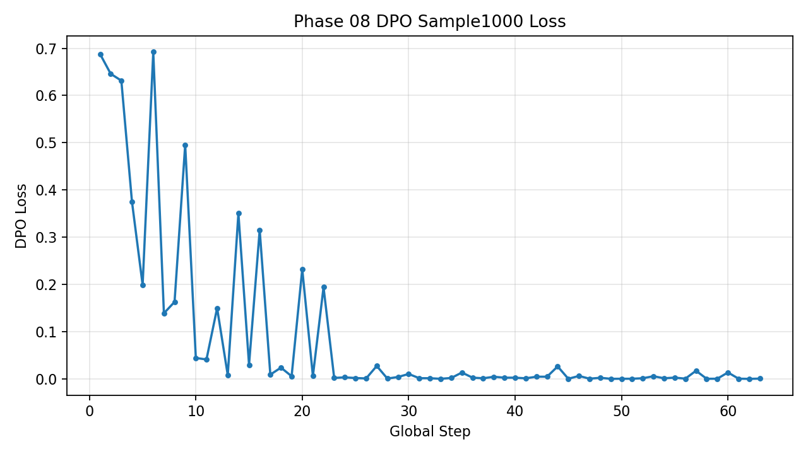

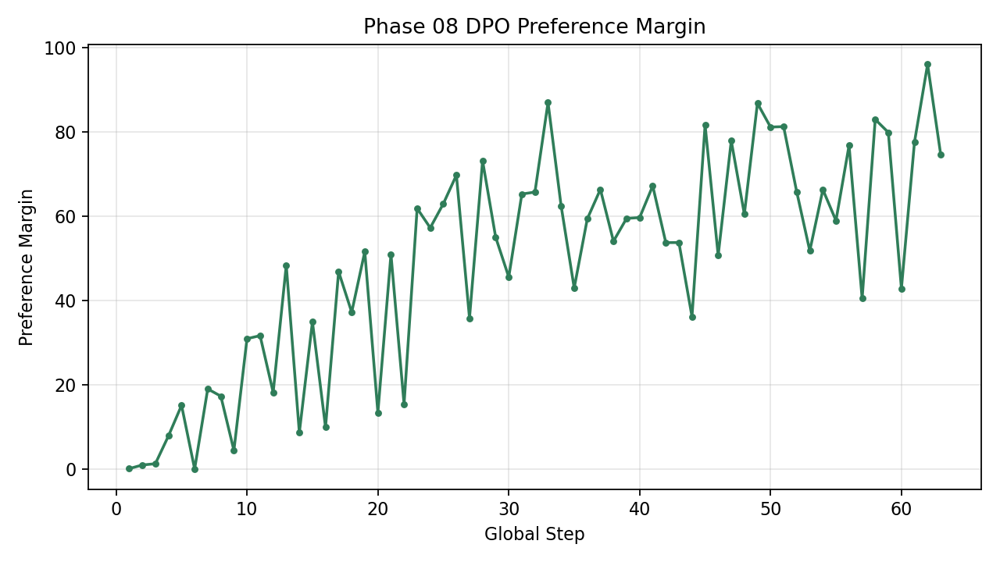

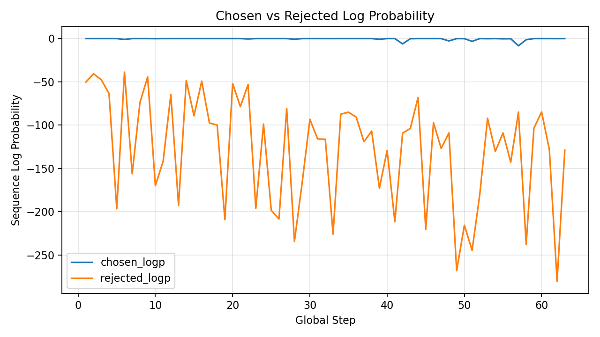

### 10.2 M3 Sample500 业务结果

M3 是 `M2 + DPO v1 adapter`。

| Split | JSON | Schema | Field EM | Risk F1 | Audit Acc | High-risk Miss | Evidence | BBox Relaxed | Error Cases |
| --- | ---: | ---: | ---: | ---: | ---: | ---: | ---: | ---: | ---: |
| test_clean | 1.000 | 0.808 | 0.807 | 0.806 | 0.650 | 0.264 | 0.727 | 0.716 | 227 |
| test_robust | 1.000 | 0.804 | 0.803 | 0.815 | 0.652 | 0.264 | 0.724 | 0.722 | 203 |
| test_unseen_template | 1.000 | 0.868 | 0.867 | 0.750 | 0.634 | 0.276 | 0.778 | 0.766 | 231 |
| test_hard_negative | 1.000 | 1.000 | 1.000 | 0.641 | 0.738 | 0.145 | 0.966 | 0.957 | 183 |

M2 vs M3 平均对比：

| Model | Audit Acc | High-risk Miss | Evidence | Error Cases |
| --- | ---: | ---: | ---: | ---: |
| M2 SFT | 0.7735 | 0.2427 | 0.8035 | 164.5 |
| M3 DPO v1 | 0.6685 | 0.2373 | 0.7987 | 211.0 |
| Delta | -0.1050 | -0.0054 | -0.0048 | +46.5 |

图表：

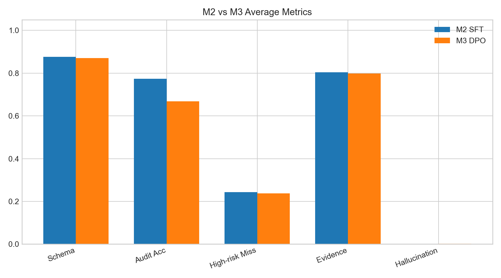

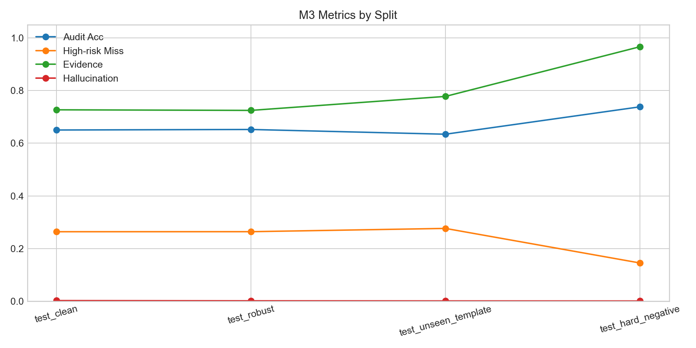

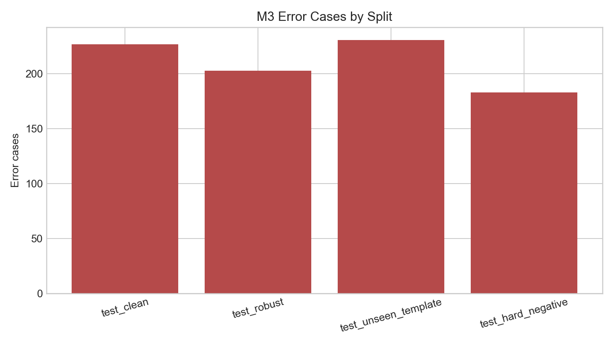

### 10.3 DPO v2 训练配置

配置：`configs/train/dpo_v2_qwen3vl_8b.yaml`。

| 项目 | 值 |
| --- | --- |
| train file | `data/mv_audit/dpo_v2/pairs_train.jsonl` |
| holdout file | `data/mv_audit/dpo_v2/pairs_holdout.jsonl` |
| decode dev file | `data/mv_audit/dpo_v2/train_decode_dev.jsonl` |
| output dir | `outputs/checkpoints/dpo/qwen3vl_8b_dpo_v2_conservative` |
| learning rate | `1.0e-6` |
| max train steps | `80` |
| loss type | `dpo` |
| beta | `0.1` |
| lambda_sft | `0.1` |
| max weight | `3.0` |
| eval steps | `10` |
| save steps | `20` |
| max holdout examples | `128` |

DPO v2 训练摘要：

| 指标 | 值 |
| --- | ---: |
| final global step | 80 |
| final train loss | 0.003978 |
| final preference margin | 55.5998 |
| holdout pair accuracy | 1.000 |
| chosen mean reward | 1.000 |
| rejected mean reward | 0.0569 |
| positive reward gap rate | 1.000 |

### 10.4 M3v2 Sample500 业务结果

M2/M3/M3v2 平均对比：

| Model | Schema | Field EM | Risk F1 | Audit Acc | High-risk Miss | Evidence | BBox Relaxed | Error Cases |
| --- | ---: | ---: | ---: | ---: | ---: | ---: | ---: | ---: |
| M2 SFT | 0.877 | 0.876 | 0.743 | 0.773 | 0.243 | 0.804 | 0.795 | 164.5 |
| M3 DPO v1 | 0.870 | 0.869 | 0.753 | 0.668 | 0.237 | 0.799 | 0.790 | 211.0 |
| M3v2 DPO | 0.870 | 0.869 | 0.742 | 0.764 | 0.255 | 0.795 | 0.786 | 166.3 |

M3v2 分 split：

| Split | JSON | Schema | Field EM | Risk F1 | Audit Acc | High-risk Miss | Evidence | BBox Relaxed | Error Cases |
| --- | ---: | ---: | ---: | ---: | ---: | ---: | ---: | ---: | ---: |
| test_clean | 1.000 | 0.816 | 0.815 | 0.781 | 0.734 | 0.284 | 0.731 | 0.719 | 186 |
| test_robust | 1.000 | 0.804 | 0.803 | 0.801 | 0.740 | 0.279 | 0.722 | 0.718 | 165 |
| test_unseen_template | 1.000 | 0.860 | 0.859 | 0.747 | 0.732 | 0.288 | 0.767 | 0.756 | 183 |
| test_hard_negative | 1.000 | 1.000 | 1.000 | 0.636 | 0.852 | 0.168 | 0.961 | 0.949 | 131 |

图表：

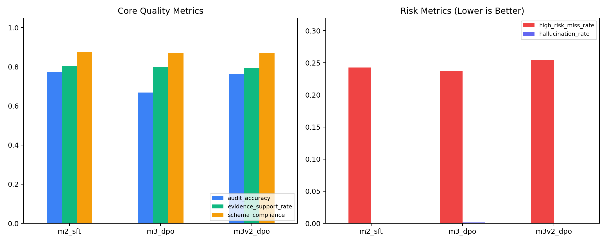

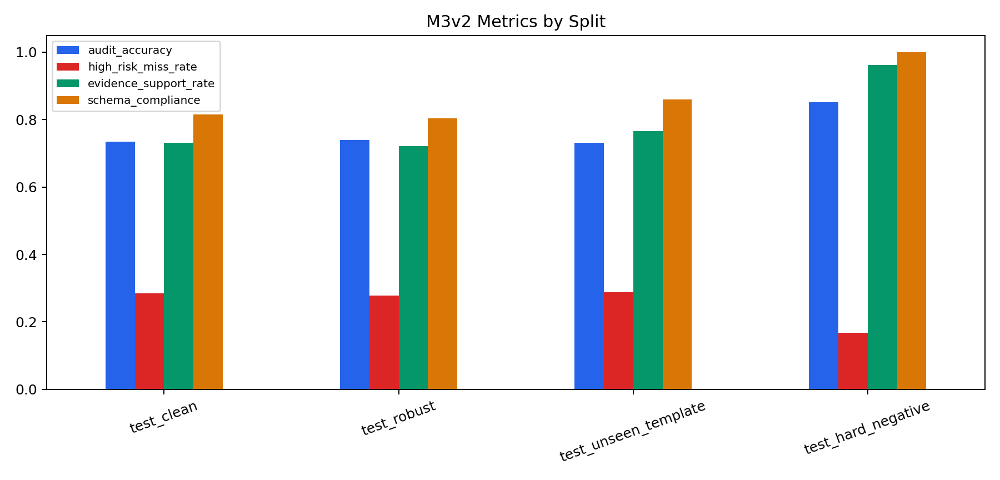

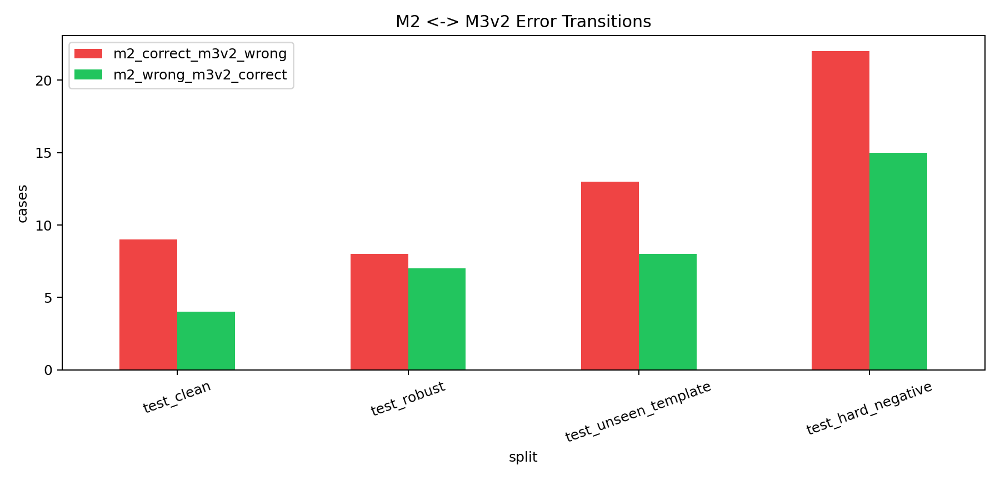

### 10.5 Two-candidate DPO v2 Ablation

为了节省服务器成本，完整 5 候选 ablation 被截停，只完成：

- `dpo_v2_baseline`
- `auxdpo_v2_strong`

后续 `auxdpo_v2_stronger`、`ipo_v1`、`ipo_aux_v1` 未继续跑。

Train decode dev 结果：

| Variant | Cases | JSON | Schema | Field EM | Risk F1 | Audit Acc | High-risk Miss | Evidence | Error Cases |
| --- | ---: | ---: | ---: | ---: | ---: | ---: | ---: | ---: | ---: |
| dpo_v2_baseline | 152 | 1.000 | 0.868 | 0.868 | 0.901 | 0.836 | 0.230 | 0.810 | 44 |
| auxdpo_v2_strong | 152 | 1.000 | 0.868 | 0.868 | 0.901 | 0.836 | 0.230 | 0.810 | 42 |

图表：

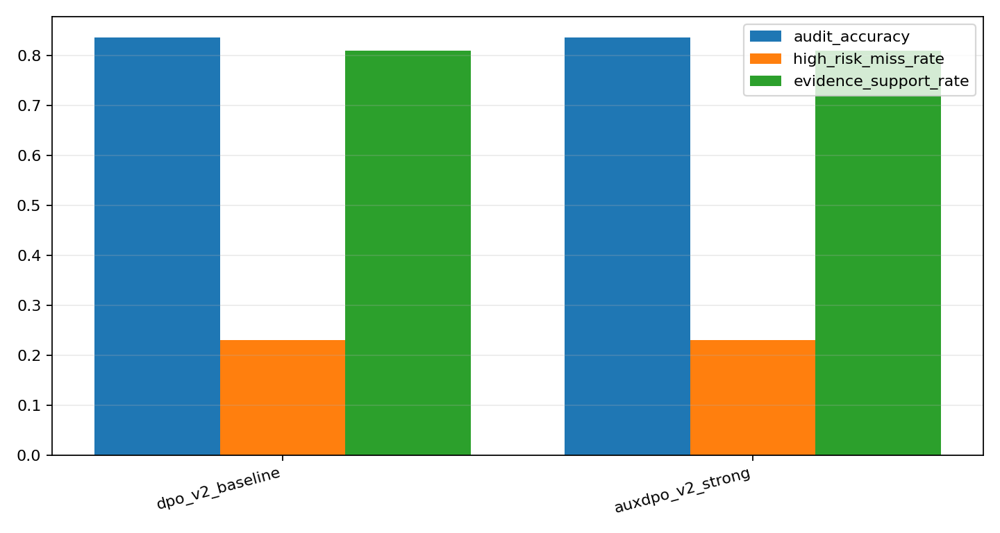

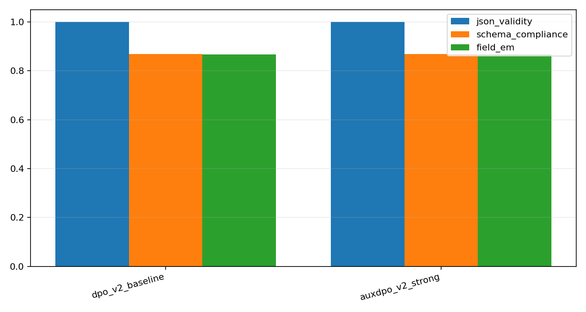

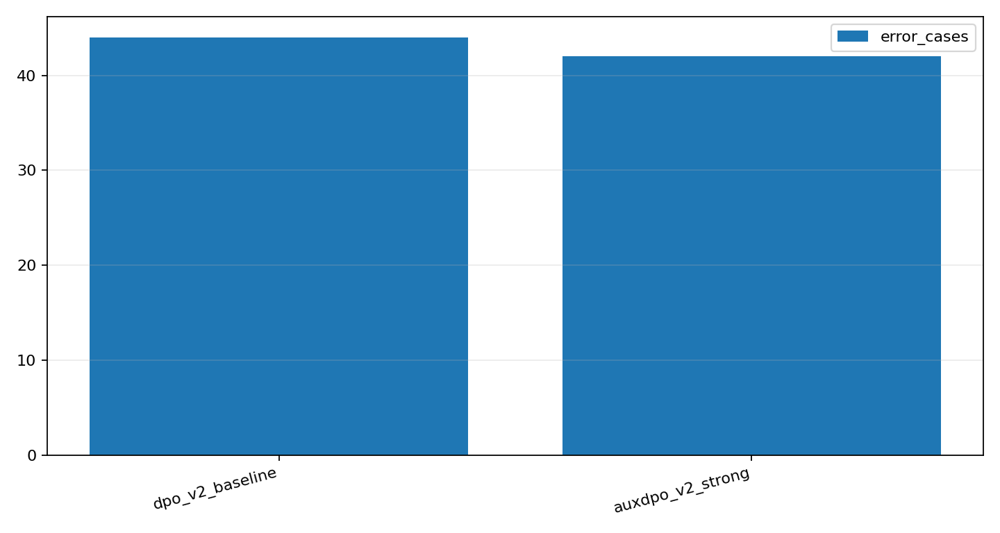

结论：AuxDPO 只减少 2 个 error cases，核心业务指标没有改善，不值得直接扩大到 sample500。

## 11. DPO 实验结果分析

### 11.1 为什么 DPO v1 失败

DPO v1 表面成功：

- loss 从 `0.6878` 降到 `0.000568`。
- preference margin 从 `0.1075` 增到 `74.731`。
- chosen reward 均值为 `1.0`，rejected reward 均值为 `0.4601`。

但业务结果失败：

- `Audit Accuracy` 从 M2 `0.7735` 降到 M3 `0.6685`。
- `Error Cases Avg` 从 `164.5` 升到 `211.0`。
- `High-risk Miss Rate` 只从 `0.2427` 小幅到 `0.2373`，没有达到至少下降 `0.03` 的目标。

这说明 DPO v1 学会了区分当前 pair，却没有学会更稳健的审计行为。

### 11.2 错误迁移

DPO 失败诊断归档在 `docs/experiments/phase08_dpo_diagnosis/`。

图表：

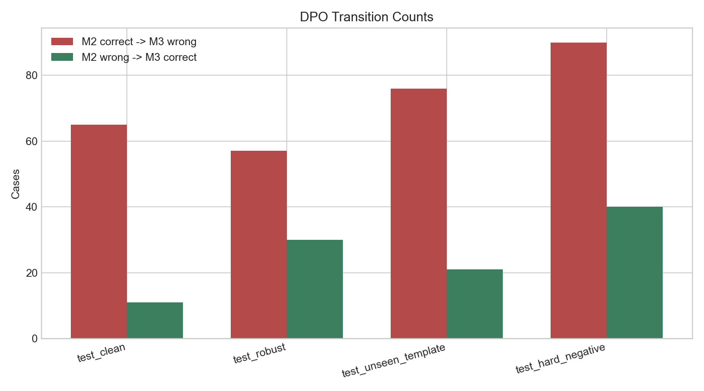

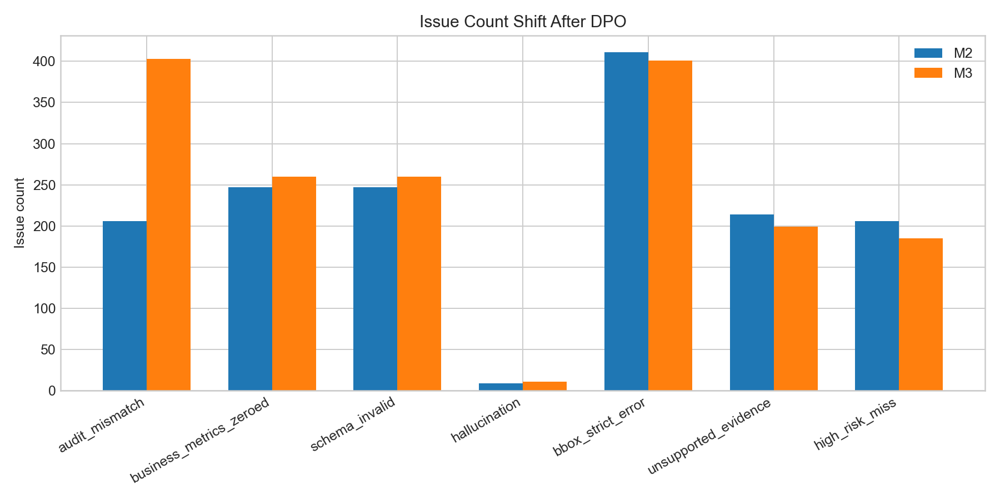

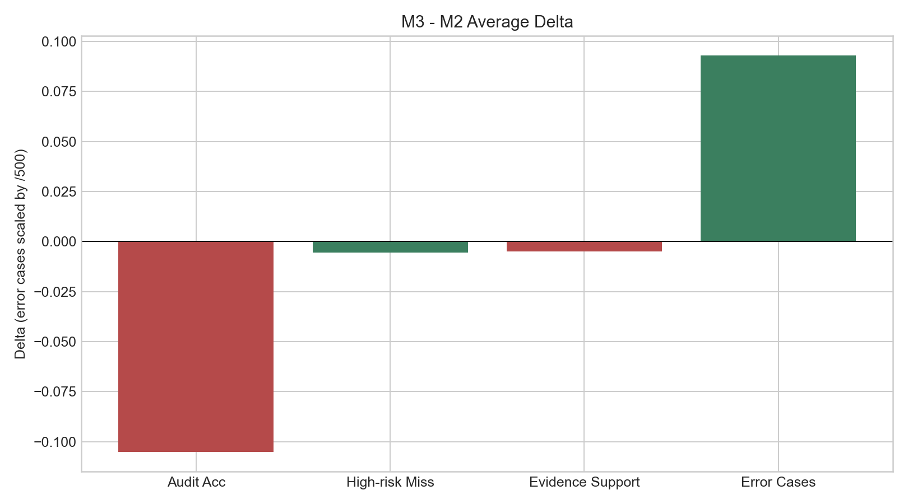

核心现象：

| 问题 | 解释 |
| --- | --- |
| pair 太容易 | loss 接近 0、margin 极大，说明模型把训练 pair 区分开了，但 pair 可能不能代表真实生成错误 |
| 目标过窄 | DPO 只优化 chosen/rejected 偏好，不直接优化 Audit Accuracy、Evidence Support 或 High-risk Miss |
| 审计边界负迁移 | 模型在一些 M2 原本正确的 case 上变错，说明偏好训练破坏了部分 SFT 能力 |
| 训练强度过大 | sample1000 已把 margin 拉到非常大，可能过度拟合 pair 信号 |
| 缺少 holdout 监控 | v1 主要看训练动态，缺少独立 pair holdout 与 train decode dev 闭环 |

### 11.3 DPO v2 修复了什么

DPO v2 的改进包括：

- Train-only 数据来源。
- case-level holdout 和 decode-dev。
- hard rejected、high-risk miss、protective、normal calibration 四类 pair。
- weighted DPO。
- 较低 learning rate。
- `lambda_sft * chosen NLL` 辅助项。
- holdout pair accuracy 和 margin 监控。

结果上，M3v2 相比 M3：

- `Audit Accuracy` 从 `0.6685` 回升到 `0.7645`。
- `Error Cases Avg` 从 `211.0` 降到 `166.3`。
- Evidence Support 只小幅下降，在可接受边界内。

但 M3v2 没有解决关键目标：

- High-risk Miss 从 M2 `0.2427` 变为 M3v2 `0.2546`。
- 方向变差，不满足“至少下降 0.03”的成功标准。

### 11.4 最终 DPO 判断

当前 DPO 结论应写成负结果，而不是“还没调好”的模糊结论：

```text
DPO v1: loss/margin 成功，但业务显著失败。
DPO v2: 修复总体 accuracy 负迁移，但 high-risk miss 目标失败。
two-candidate ablation: AuxDPO 没有带来核心指标改善。
```

因此不建议直接扩大 DPO/GRPO。下一步应先修 high-risk miss 的错误机制和数据分布。

## 12. High-risk Repair 与后续路线

### 12.1 当前修复包

High-risk Repair Pack 归档：

```text
docs/experiments/phase08_high_risk_repair_pack_20260813/
```

主要文件：

| 文件 | 内容 |
| --- | --- |
| `high_risk_miss_diagnosis_report.md` | 高风险漏检诊断报告 |
| `metric_snapshot.csv` | M2/M3/M3v2/two-candidate 指标快照 |
| `error_source_summary.csv` | 错误来源归因 |
| `representative_high_risk_cases.jsonl` | 代表性高风险错误 |
| `candidate_cases.jsonl` | 候选修复 case |
| `repair_pack_sft.jsonl` | 120 条 repair SFT 样本 |
| `repair_sft_train_mix.jsonl` | 240 条 repair + calibration mix |
| `leakage_check.json` | 泄漏检查 |
| `repair_pack_manifest.json` | manifest |

Repair Pack 约束：

| 约束 | 值 |
| --- | --- |
| selected candidates | 120 |
| DPO v2 holdout overlap | 0 |
| train decode dev overlap | 0 |
| sample500 overlap | 0 |
| policy | Train-only high-risk non-pass repair candidates |

### 12.2 repair_sft_r1 目标

下一步不是继续堆 DPO/GRPO，而是跑小规模 repair SFT：

```text
120 high-risk repair samples
+ 120 calibration samples
-> repair_sft_r1 LoRA-SFT
-> only train_decode_dev inference
-> evaluate_all
-> gate decision
```

验收门槛：

| 指标 | 门槛 |
| --- | --- |
| JSON Validity | `1.0` |
| Audit Accuracy | 不低于 M2，或最多下降 `0.01` |
| High-risk Miss Rate | 相比 M2 至少下降 `0.03` |
| Evidence Support Rate | 最多下降 `0.01` |

停止条件：

- 如果只减少 error cases，但 High-risk Miss 不降，停止训练路线。
- 如果 schema invalid 明显存在，先修 prompt/schema 输出契约。
- 小集不达标，不进入 sample500/test。

## 13. 复现实验与代码索引

### 13.1 快速代码索引

完整程序清单： [docs/code_inventory.md](docs/code_inventory.md)

| 想看什么 | 入口 |
| --- | --- |
| 数据生成 | `src/mv_audit/data_gen/` |
| 图片渲染和 bbox | `src/mv_audit/rendering/` |
| SFT/DPO/GRPO 数据构造 | `src/mv_audit/converters/` |
| SFT/DPO/GRPO 训练 | `src/mv_audit/training/` |
| 批量推理 | `src/mv_audit/inference/batch_inference.py` |
| 评测指标 | `src/mv_audit/evaluation/evaluate_all.py` |
| DPO 失败诊断 | `src/mv_audit/analysis/dpo_error_migration.py` |
| High-risk Repair | `src/mv_audit/analysis/high_risk_repair_pack.py` |

### 13.2 主要脚本入口

| 目标 | 脚本 |
| --- | --- |
| 准备环境 | `scripts/00_prepare_env.sh` |
| 下载 Qwen3-VL | `scripts/00_download_qwen3vl.sh` |
| 生成 main case | `scripts/01_generate_main_cases.sh` |
| 渲染 main 图片 | `scripts/02_render_main_images.sh` |
| 构造 SFT/DPO/GRPO 数据 | `scripts/03_build_main_train_data.sh` |
| 训练 SFT | `scripts/04_train_sft.sh` |
| 训练 DPO v1 | `scripts/05_train_dpo.sh` |
| 构造 DPO v2 pairs | `scripts/05_build_dpo_v2_pairs.sh` |
| 训练 DPO v2 | `scripts/05_train_dpo_v2.sh` |
| 通用推理 | `scripts/07_run_inference.sh` |
| 通用评测 | `scripts/08_evaluate.sh` |
| DPO 错误迁移 | `scripts/09_analyze_dpo_error_migration.sh` |
| DPO v2 ablation | `scripts/10_run_dpo_v2_ablation_5gpu_server.sh` |
| repair_sft_r1 小闭环 | `scripts/11_run_high_risk_repair_sft_r1_server.sh` |

### 13.3 关键归档路径

| 实验 | 路径 |
| --- | --- |
| Phase07 M0/M1/M2 sample500 | `docs/experiments/phase07_sample500/` |
| Phase08 DPO v1 sample1000 | `docs/experiments/phase08_dpo_sample1000/` |
| Phase08 M3 sample500 | `docs/experiments/phase08_m3_sample500/` |
| DPO 失败诊断 | `docs/experiments/phase08_dpo_diagnosis/` |
| Phase08 M3v2 sample500 | `docs/experiments/phase08_m3v2_sample500/` |
| DPO v2 baseline partial | `docs/experiments/phase08_loss_ablation_baseline_partial_20260812_5gpu_ablation_r3/` |
| two-candidate decode dev | `docs/experiments/phase08_loss_ablation_two_candidate_decode_20260812_5gpu_ablation_r3/` |
| High-risk Repair Pack | `docs/experiments/phase08_high_risk_repair_pack_20260813/` |

### 13.4 当前未完成任务

| 任务 | 状态 |
| --- | --- |
| repair_sft_r1 服务器训练 | 未完成 |
| repair_sft_r1 train_decode_dev 推理与评测 | 未完成 |
| repair_sft_r1 是否进入 sample500 | 待小集 gate 决定 |
| 正式 GRPO/M4 | 暂停，不建议在 DPO 未稳定前扩大 |
| Phase08 最终论文式 negative result | README 已整理主结论，仍可在后续补 repair_sft_r1 结果 |

### 13.5 Git 与资产边界

Git 中保留：

- 代码。
- 配置。
- 小词典。
- README 和文档。
- 实验 metrics、图表、error cases 摘要、manifest。

Git 中不保留：

- 模型权重。
- LoRA/DPO checkpoint 大文件。
- 全量 predictions。
- 原始训练日志全集。
- 大规模渲染图片。

当前 README 只报告已验证结果；未完成的 `repair_sft_r1` 不被写成已完成。
