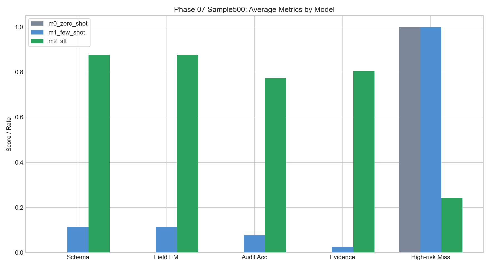
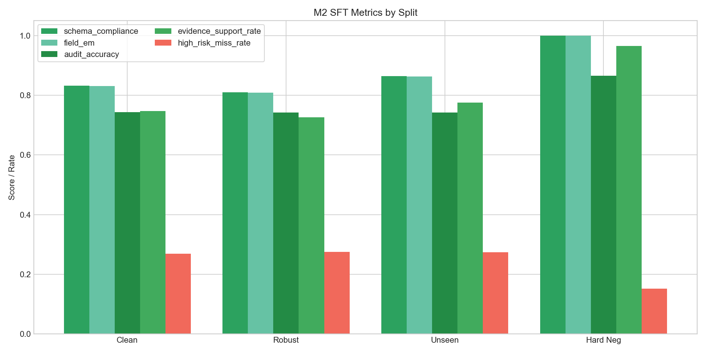
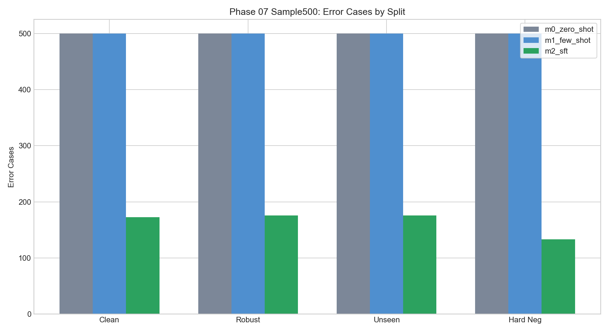

# Phase 07 Sample500 抽样评测报告

更新时间：2026-08-11

## 实验设置

- 任务范围：Phase 07，只评估 `M0 zero-shot`、`M1 few-shot`、`M2 LoRA-SFT`，不包含 DPO/GRPO。
- 抽样规模：`3 个模型 × 4 个测试集 × 500 条 = 6000` 条预测。
- 预测目录：服务器 `outputs/predictions/phase07_sample500/`。
- 报告目录：服务器 `outputs/eval_reports/phase07_sample500/`。
- 本地归档：`docs/experiments/phase07_sample500/`。

## 主要结论

- `M2 LoRA-SFT` 相比 M0/M1 有显著提升，平均 `Audit Accuracy=0.774`、`Evidence Support Rate=0.804`、`Field EM=0.876`。
- `M2` 的 JSON Validity 在四个 split 上均为 `1.000`，说明 SFT 已经显著稳定结构化输出。
- `M2` 仍存在高风险漏检，四个 split 的 `High-risk Miss Rate` 约为 `0.152-0.276`，后续 Phase 08 的 DPO/GRPO 仍有推进价值。
- `M0` 基本无法产生符合任务 schema 的有效审计输出；`M1` few-shot 有轻微改善，但高风险漏检仍接近 `1.000`。

## M2 核心指标

| Split | JSON | Schema | Field EM | Audit Acc | High-risk Miss | Evidence | BBox Relaxed | Error Cases |
| --- | --- | --- | --- | --- | --- | --- | --- | --- |
| test_clean | 1.000 | 0.832 | 0.831 | 0.744 | 0.270 | 0.747 | 0.737 | 173 |
| test_robust | 1.000 | 0.810 | 0.809 | 0.742 | 0.276 | 0.727 | 0.723 | 176 |
| test_unseen_template | 1.000 | 0.864 | 0.863 | 0.742 | 0.274 | 0.775 | 0.764 | 176 |
| test_hard_negative | 1.000 | 1.000 | 1.000 | 0.866 | 0.152 | 0.965 | 0.954 | 133 |

## 模型平均指标

| Model | Schema | Field EM | Risk F1 | Audit Acc | High-risk Miss | Evidence | Hallucination | BBox Relaxed | Avg Error Cases |
| --- | --- | --- | --- | --- | --- | --- | --- | --- | --- |
| m0_zero_shot | 0.000 | 0.000 | 0.000 | 0.000 | 1.000 | 0.000 | 0.000 | 0.000 | 500.000 |
| m1_few_shot | 0.115 | 0.114 | 0.022 | 0.079 | 0.999 | 0.025 | 0.575 | 0.010 | 500.000 |
| m2_sft | 0.877 | 0.876 | 0.743 | 0.774 | 0.243 | 0.804 | 0.001 | 0.795 | 164.500 |

## 图表

## 归档文件

- `metrics_summary.csv`：完整 12 行评测汇总。
- `metrics_by_model.csv`：按模型聚合均值。
- `error_cases/`：12 个 error cases JSONL 文件。
- `figures/`：实验对比图。
- `artifact_manifest.json`：归档文件清单和 SHA256。

## Phase 08 依据

Phase 07 已证明 LoRA-SFT 能稳定 JSON 输出，并显著提升字段抽取、证据定位和审计准确率；但高风险漏检率仍偏高。Phase 08 可以在此基础上优先做小规模 DPO，用偏好数据进一步压低高风险漏检和无证据结论，再决定是否进入完整 DPO/GRPO。
