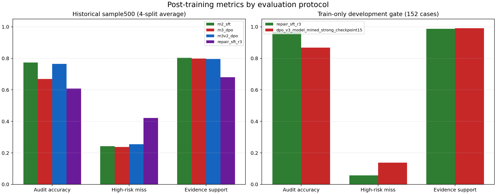
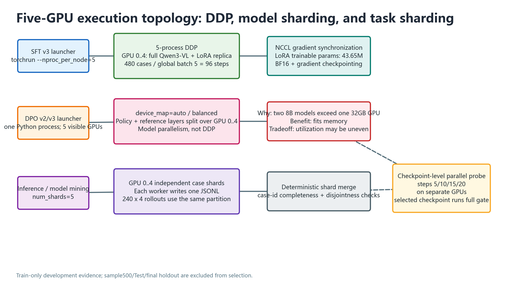
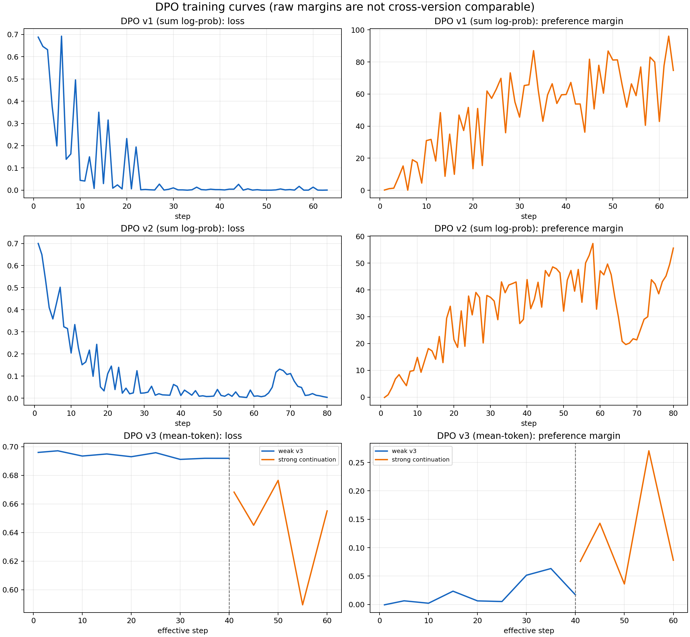
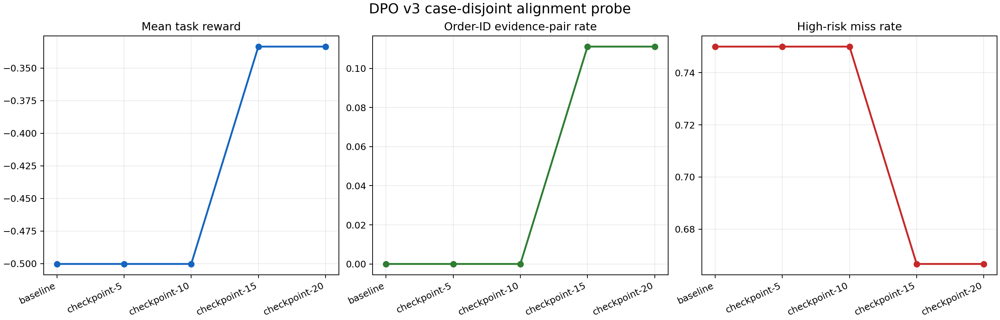
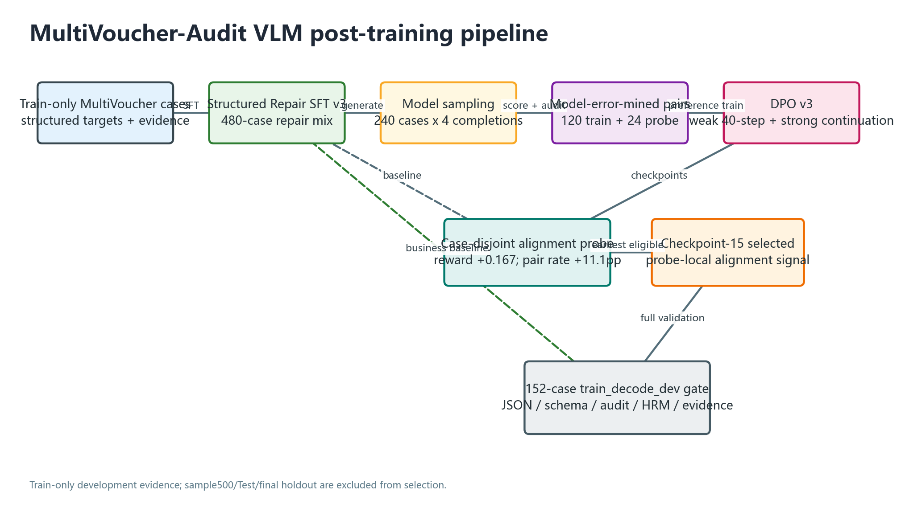
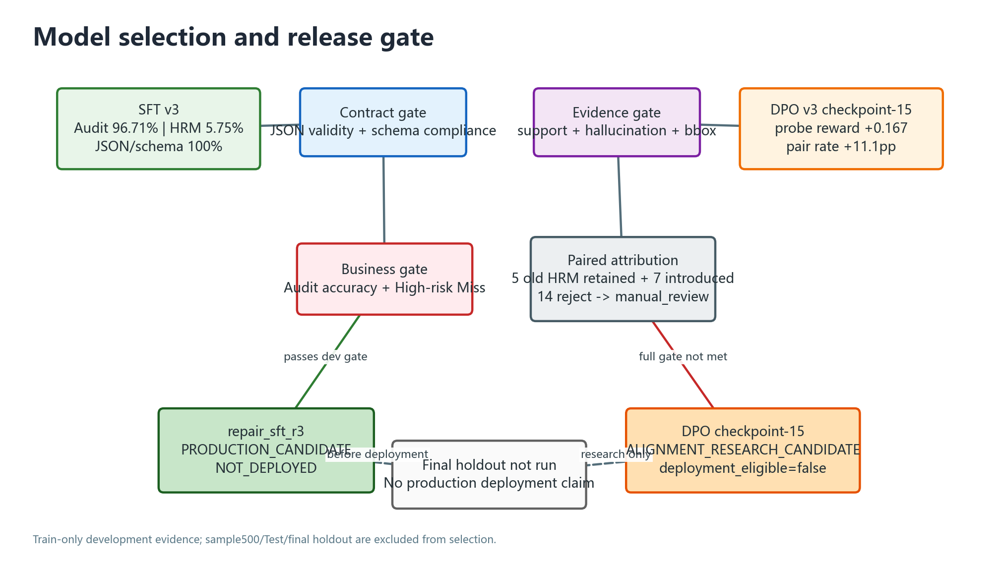

# Phase 10：Model-Error-Mined DPO v3

## 1. 阶段结论

本阶段完成了从 Structured Repair SFT v3 出发的模型采样、困难偏好对构造、DPO 训练、case-disjoint alignment probe、152 条 `train_decode_dev` 全量门禁和逐 case 错误归因。

- `repair_sft_r3` 曾是开发门禁上的 `PRODUCTION_CANDIDATE`，但后续 final_holdout_v1 已消耗且失败，sample500 历史口径诊断也退化，最终状态为 `FINAL_HOLDOUT_FAILED / NOT_DEPLOYED`。
- DPO v3 checkpoint-15 是 `ALIGNMENT_RESEARCH_CANDIDATE`：局部 probe 有可测量提升，但全量业务门禁未通过，禁止替代 SFT v3。
- 本阶段不使用 sample500/Test 选模型或调 reward；sample500 保留为历史 benchmark，R3 的 sample500 补跑仅用于 final 失败后的诊断补表。

## 2. Benchmark 边界

项目包含两套不可混为一谈的评测协议：

| Benchmark | 用途 | 模型 | 规模 |
| --- | --- | --- | ---: |
| sample500 | 历史业务 benchmark / 失败后诊断 | M2、DPO v1、DPO v2、R3 diagnostic | 4 个 split，每个 500 条，表中为 split 平均 |
| train_decode_dev | Train-only 开发门禁 | SFT v3、DPO v3 | 152 条 |

因此，SFT v3 的 `0.9671` 不能直接与 M2 的 `0.7735` 宣称为同一测试集上的提升。完整机器可读表见 [post_training_metrics.csv](post_training_metrics.csv)。



### 五卡执行方式



可编辑源文件：[multi_gpu_execution_topology.drawio](figures/multi_gpu_execution_topology.drawio)

- SFT v3 使用五进程 DDP，每卡一份完整模型，LoRA 梯度通过 NCCL 同步；480 条样本以全局 batch 5 完成 96 step。
- DPO v3 使用单进程 `device_map=balanced`，policy/reference 的层切分到五卡；这是为解决单卡 OOM 的模型切分，不是 DDP。
- model mining 和 152 条推理按 case 分为五个 shard，每卡独立生成，最后确定性 merge。
- alignment probe 按 checkpoint 分配 GPU 并行评测，仅选中的 checkpoint 运行 full gate。

### Adapter 谱系归档

M2 -> R1 -> R2 -> R3 -> DPO weak checkpoint-40 -> DPO strong checkpoint-15 六级 adapter 已全部得到 `VERIFIED`。机器可读清单见 [model_lineage_archive.json](model_lineage_archive.json)，本地差集和哈希审计见 [model_lineage_archive_audit.json](model_lineage_archive_audit.json) / [model_lineage_archive_audit.md](model_lineage_archive_audit.md)。

归档使用 minimal adapter 策略：保留加载推理所需文件，不把 optimizer state 或中间历史 checkpoint 伪装成已归档。归档完成后服务器关机请求成功，SSH 已关闭。

## 3. 指标总表

### 3.1 历史 sample500

| 模型 | Audit Accuracy | High-risk Miss | Evidence Support | 结论 |
| --- | ---: | ---: | ---: | --- |
| M2 LoRA-SFT | 0.7735 | 0.2427 | 0.8035 | 历史 sample500 baseline |
| DPO v1 | 0.6685 | 0.2373 | 0.7987 | 明显负迁移 |
| DPO v2 | 0.7645 | 0.2546 | 0.7952 | 恢复 Audit，但未改善 HRM |
| Structured Repair SFT v3 | 0.6075 | 0.4217 | 0.6801 | final 失败后诊断；相对 M2 明显退化 |

### 3.2 当前 train_decode_dev

| 模型 | JSON / Schema | Audit Accuracy | High-risk Miss | Evidence Support | Error cases |
| --- | ---: | ---: | ---: | ---: | ---: |
| Structured Repair SFT v3 | 1.000 / 1.000 | **0.9671** | **0.0575** | 0.9876 | 23 |
| Model-Mined DPO v3 checkpoint-15 | 1.000 / 1.000 | 0.8684 | 0.1379 | **0.9904** | 40 |

## 4. DPO v1 → v2 → v3 的方法演进

### DPO v1：easy rejected saturation

DPO v1 的人工 rejected 主要是规则式标签篡改。训练 loss 降至约 `0.000568`，preference margin 升至约 `74.731`，但 sample500 Audit Accuracy 从 `0.7735` 降至 `0.6685`。这证明训练 pair 可分不等于生成策略改善。

### DPO v2：保护性约束

DPO v2 引入 hard rejected、high-risk repair、protective pair、normal calibration、weighted DPO 和 SFT auxiliary loss。它缓解了 v1 的 Audit 崩塌，但 HRM 仍由 M2 的 `0.2427` 恶化为 `0.2546`。

### DPO v3：模型错误挖掘

SFT v3 对 240 条 Train-only case 各采样 4 个输出，共得到 960 个 completions，其中 894 个 schema 合法。原始 clipped reward 大量饱和，难以直接产生预设 gap 的 pair，因此最终使用模型真实失败输出和结构化 expert target 构造 120 条 train pair、24 条 case-disjoint probe pair。

DPO v3 使用 assistant-token 平均 log-prob，避免长 JSON 的累加 margin 失真。Phase 10 已从服务器归档 weak-v3 的 40-step 原始日志和后续 20-step strong continuation 日志；图中将 strong continuation 的 step 映射到 weak step-40 之后，虚线标记两阶段边界。



原始数据见 [dpo_v3_weak_training_history.csv](dpo_v3_weak_training_history.csv) 和 [dpo_v3_strong_training_history.csv](dpo_v3_strong_training_history.csv)。图中 v1/v2 使用 sequence-sum log-prob，v3 使用 mean-token log-prob，原始 margin 数值不能跨版本直接比较。

## 5. Alignment Probe

24 条 case-disjoint probe 包含 18 条 order-id mismatch 和 6 条 low/pass calibration。checkpoint-15 相对 SFT v3 baseline：

- mean task reward：`-0.5003 → -0.3336`，提升 `0.1667`；
- order-id 双侧证据命中率：`0 → 0.1111`，提升 `11.11pp`；
- high-risk miss：`0.7500 → 0.6667`；
- JSON valid rate 保持 `1.0`，false escalation 保持 `0`。



checkpoint-15 是最早满足局部 probe gate 的 checkpoint，但 probe 有 18/24 条集中在 order-id，不能单独承担业务模型选择。

## 6. 152 条全量门禁

checkpoint-15 在 `train_decode_dev` 上得到：

- Audit Accuracy：`0.9671 → 0.8684`；
- High-risk Miss：`0.0575 → 0.1379`；
- Evidence Support：`0.9876 → 0.9904`；
- JSON validity / schema compliance：保持 `1.0`。

修正后的 [final_alignment_decision.corrected.json](final_alignment_decision.corrected.json) 状态为 `ALIGNMENT_GATE_NOT_MET`。原远端 decision 的指标和状态正确，但比较脚本曾读取不存在的 `issue_codes`，导致 HRM case 列表为空；现已兼容评测器实际输出的 `issues` 字段。

## 7. 错误归因

修正后的 case 级统计：

| 项目 | 数量 |
| --- | ---: |
| SFT v3 High-risk Miss | 5 |
| DPO v3 High-risk Miss | 12 |
| 修复的 High-risk Miss | 0 |
| 新增的 High-risk Miss | 7 |
| DPO v3 audit mismatch | 20 |

20 条 audit mismatch 包含 14 条 `reject_recommendation → manual_review`、5 条 `reject_recommendation → pass` 和 1 条 `pass → reject_recommendation`。其中 13 条 GT 是 `amount_mismatch`，1 条是 `over_reimbursement`，5 条是 `order_id_mismatch`。

关键现象是：多条 amount mismatch 已被 DPO 正确识别并给出正确金额证据，但审核动作被降为 `manual_review`。这属于偏好决策边界漂移，而不是 schema 或视觉字段抽取失败。机器可读统计见 [error_attribution_summary.json](error_attribution_summary.json)。

## 8. 四个案例

### 8.1 正向 probe：MV_MAIN_004522

- SFT v3：`low/pass`，未输出订单截图和报销单两侧 order-id evidence。
- DPO checkpoint-15：`high/reject_recommendation`，识别 `order_id_mismatch`，两侧 order-id evidence 完整。
- 判断：局部偏好对齐成功。

### 8.2 正向 probe：MV_MAIN_020454

- SFT v3：`low/pass`，缺少双侧 order-id evidence。
- DPO checkpoint-15：`high/reject_recommendation`，双侧证据完整。
- 判断：第二个独立 case 上复现同类正向变化。

### 8.3 过拟合：MV_MAIN_023069

- SFT v3：未出现在 baseline errors 中。
- GT：订单金额 `1310.98`，其余金额 `1160.98`，应为 `high/reject_recommendation`。
- DPO：正确识别 `amount_mismatch` 并给出四侧金额证据，但输出 `high/manual_review`。
- 判断：感知正确，决策边界退化。

### 8.4 过拟合：MV_MAIN_015818

- SFT v3：未出现在 baseline errors 中。
- GT：订单金额 `4727.25`，其余金额 `4220.76`，应为 `high/reject_recommendation`。
- DPO：识别 `amount_mismatch`，但输出 `high/manual_review`。
- 判断：与上一例构成可复现的跨 case 决策降级。

完整原始字段见 [case_studies.json](case_studies.json)。

## 9. 模型选择

| 角色 | 模型 | 状态 | 说明 |
| --- | --- | --- | --- |
| Final-holdout failed | `repair_sft_r3` | `NOT_DEPLOYED` | 开发门禁最佳未泛化；final_holdout_v1 与 sample500 诊断均退化 |
| Alignment research candidate | DPO v3 checkpoint-15 | `deployment_eligible=false` | probe 有局部收益，全量 gate 未通过 |
| Historical baseline | M2 | frozen sample500 baseline | 用于保留 Phase07/08 历史可比性 |

机器可读登记见 [model_selection.json](model_selection.json)。

### 9.1 Adapter 归档

SFT v3 adapter 已拉回 `outputs/model_candidates/repair_sft_r3/`，归档 SHA256 为 `476757f15ca7797b09e4b08599e3115847be5d56bfec79f4a53387575dbf9ff6`，权重 SHA256 为 `2cf2bbdc7cc507eb4833332900ee516e2cc40792d17576714ef0a11591ac5fe2`。远端与本地逐文件哈希一致，`adapter_config.json` 可解析且 safetensors 非空；归档完成后服务器已关机。

归档同时保留 weak-v3 与 strong-v3 原始训练日志。完整路径、哈希、候选状态和 final-holdout 标记以 [model_selection.json](model_selection.json) 为准。

## 10. 架构图



可编辑源文件：[post_training_pipeline.drawio](figures/post_training_pipeline.drawio)



可编辑源文件：[model_selection_gate.drawio](figures/model_selection_gate.drawio)

## 11. 复现

```powershell
$env:PYTHONPATH = "src;."
python tools/compare_dpo_v3_results.py <metrics/errors/selection arguments>
python tools/build_phase10_post_training_report.py
python tools/build_phase10_diagrams.py
```

本报告主体使用 Train-only 产物；R3 sample500 行来自后续诊断补跑，仅用于补表和失败分析，没有启动新训练或 DPO V3 checkpoint-15 推理。
